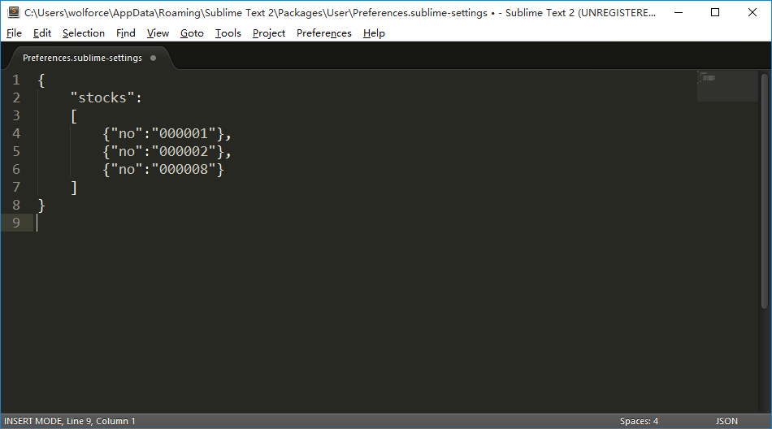
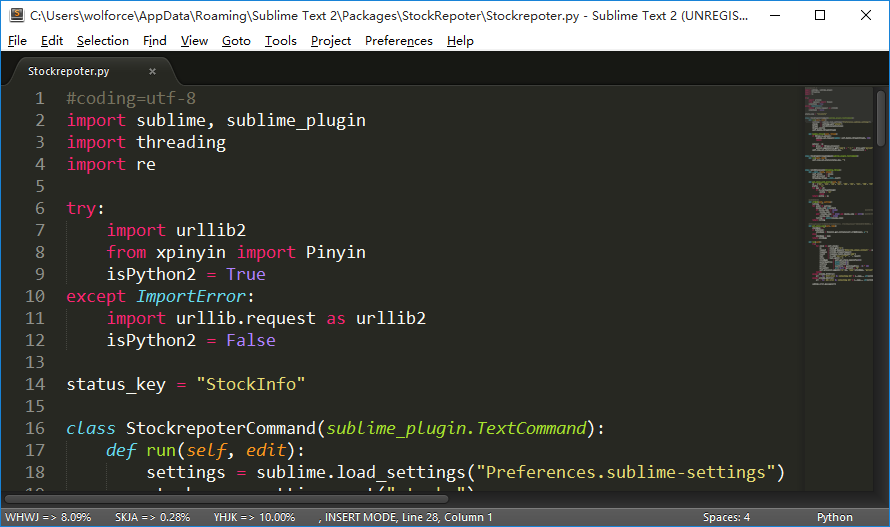
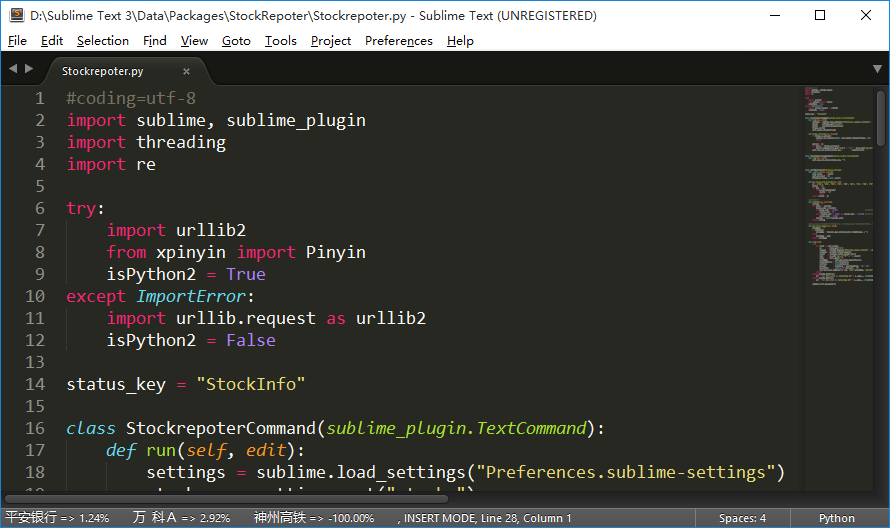

Sublime 中国A股涨幅查询插件
========

##这个插件有什么用？
- 安装本插件后，可以通过快捷键拉取设置好的`A股股票的涨跌幅信息`，并显示在sublime底部的状态栏上
- 插件同时支持`Sublime Text 2`与`Sublime Text 3`，在Windows环境测试通过，其他环境未测试

##安装
- 打开插件目录. 主菜单 -> Preferences -> Browse Packages.
- 下载本插件，把 StockRepoter 目录复制到上一步打开的sublime的插件目录下
- 打开配置文件. 主菜单 -> Preferences -> Settings - User
- 配置股票信息.在打开的配置文件里写入stocks列表，格式如下：
```javascript
"stocks":
    [
        {"no":"000001"},
        {"no":"000002"},
        {"no":"000008"}
    ]
```

- 重启sublime即可完成安装

##使用
- 在sublime的任意窗口按下`Ctrl+Alt+8`拉取涨跌幅信息并在状态栏显示
- 在同一窗口按下`Ctrl+Alt+9`清除状态栏上的股票信息
- 插件不会主动请求股票信息，只有在按下快捷键时才发起请求
- 在Sublime2里，因为不支持在状态栏显示中文，所以股票名使用拼音缩写表示
- 在Sublime3里，股票名直接使用中文表示

##效果预览
- Sublime Text 2 里的效果


- Sublime Text 3 里的效果

